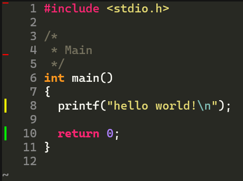
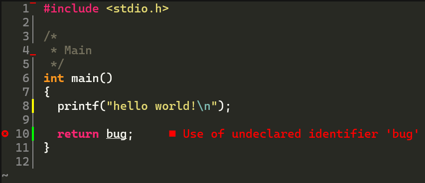

# Git Gutter for Neovim



Simple Git gutter plugin for Neovim providing visual information
about differences between the current buffer and staged/HEAD revision
of the file being edited.

The main purpose of this plugin is to solve the issue of co-existence
of multiple types of signs (e.g.
[gitsigns + LSP diagnostics](https://github.com/lewis6991/gitsigns.nvim/issues/95)).
See [Custom rendering](#custom-rendering) for details. Unlike in other, more
complex Git gutters (e.g. [gitsigns](https://github.com/lewis6991/gitsigns.nvim)),
no additional "git diff" functionality is supported.

## Usage

`~/config/nvim/init.lua`:

``` lua
-- Install using the built-in package manager (neovim>=0.12)
vim.pack.add({ "https://github.com/d3m3t3r/gitgutter.nvim" })

-- Setup (default values shown)
require("gitgutter").setup({
  -- Extmarks/signs symbols.
  signs = {
    add          = "┃",
    change       = "┃",
    delete       = "_",
    delete_above = "‾",
  },

  -- Extmarks priority.
  extmarks_priority = 10,

  -- Delay before updating after a change in the insert mode.
  debounce_ms = 150,

  -- Disable rendering of extmarks/signs.
  no_render_signs = false,
})
```

Additionally, `GitGutterAdd`, `GitGutterChange` and `GitGutterDelete` highlights
can be used to customize extmarks/signs.

## Custom rendering

If `no_render_signs` is set, `state` maps the buffer number to the map of line
numbers to (unused) `sign_text` and `sign_hl_group` values. This allows for any
alternative custom presentation, for instance, the following example utilizes
`statuscolumn`.



`~/config/nvim/init.lua`:

``` lua
-- LSP setup...

require("gitgutter").setup({
  no_render_signs = true,
})

function custom_statuscolumn()
  local state = require("gitgutter").state[vim.api.nvim_get_current_buf()]
  if state then
    state = state[vim.v.lnum - 1]
  end
  return table.concat({
    "%s%l",
    state and ("%#" .. state["sign_hl_group"] .. "#" .. state["sign_text"]) or "│",
    " ",
  })
end

vim.opt.statuscolumn = "%!v:lua.custom_statuscolumn()"
vim.opt.signcolumn = "auto"
```
